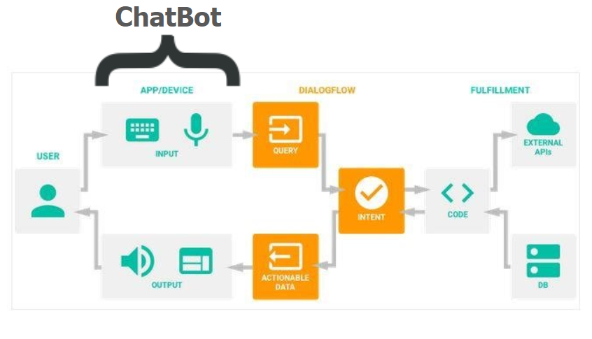

# About
This is a simple Bot capable of placing order and getting status of existing order.
The Backend of the Bot is enabled by [Dialogflow](https://dialogflow.com/ "Dialogflow") and the Frontend is enabled by [BotCopy](http://botcopy.com/ "BotCopy"). All the orders placed using the bot are persisted in [Firebase Database](https://firebase.google.com/ "Firebase Database").
 You can try it out [HERE](https://bit.ly/YoYo-Pizza).
 
 ## Instructions

### Using the Bot

- **Order a Pizza**  
Simply say **order** anytime and the Bot will prompt you and get all the details. Once the order is placed, an Order ID.
- **Order Status**  
Just say **status** and the Bot will ask you the Order ID. Upon entering Order ID, the Bot will revert back with the order status.

### Accessing the Database  
Database can be accessed [HERE](bit.ly/YoYo-DB "HERE") or by clicking the **Database** button (top-right corner) on the home page.
sdsfsf
## Architecture  
Below is a flow chart which can be helpful in understanding the working of the project.
 
 

